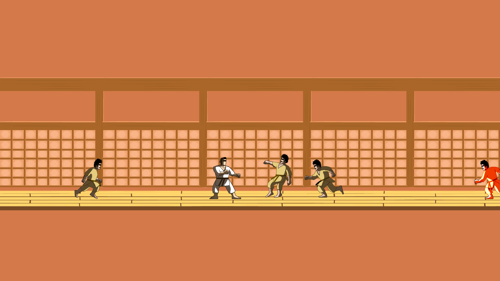

# Horacio: the oriental way

## Sebastián Rodríguez - Juan Pedro Cosentino - Martín Salvagno - Rodrigo López - Gastón Martínez
## Octubre 2024

1. [Historia](#historia)
2. [Materiales](#materiales)

# Historia

Horacio es un pescador uruguayo, oriental hasta la medula que naufraga una noche de tormenta y es rescatado por un monje shaolin en las costas de su templo.
Como forma de recuperarse el maestro lo introduce en las legendarias artes del kung fu, volviéndose uno de sus discípulos.
Pero la paz no seria para siempre, ya que el maestro seria secuestrado por karatecas malvados

Ahora Horacio debe cobrar venganza contra los karatecas y salvar a su maestro.

# Materiales
* [GDD](https://docs.google.com/document/d/1Qyu2bwtg2OYRtT2_TUSZMueyu9lHU8OqyzlWGQGN1q0/edit?tab=t.0)
* [Trello](https://trello.com/b/ADLBfnFk/pablos-gaming-horacio-the-oriental-way)
* [Drive](https://drive.google.com/drive/folders/1aJeQvM4h1MuBi_v362QWHS4GRrGJBjY5)